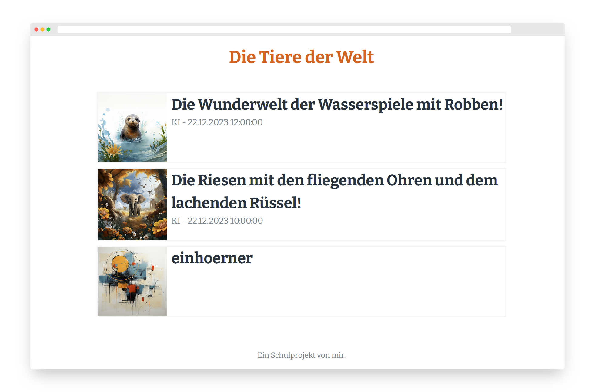
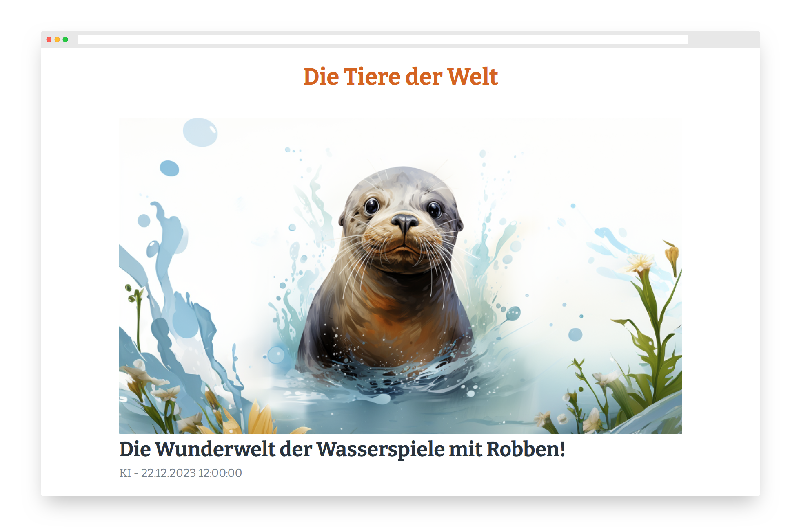

# PHPureMD





PHPureMD ist ein minimalistischer Blog, um Schüler:innen im Informatikunterricht grundlegende Konzepte von Webseiten zu vermitteln. Es wurde absichtlich eine möglichst einfache Programmierung mit vielen Kommentaren verwendet. Auch sind erste Inhalte vorhanden, um diese adaptieren zu können. Die Bilder und Texte wurden dabei jeweils von einer KI erzeugt.

## Installation

Dieses Repository auf einem PHP-fähigen Webserver legen und fertig.

Wenn dieser frei im Internet ist und Urheberrecht keine Kernkompetenz der Schüler:innen ist oder personenbezogene Daten einfließen, dann sollte noch ein einfacher Zugriffsschutz etwa mit [Basic-Auth](https://homepage-kosten.de/htaccess.php) hinzugefügt werden.

Wer möchte, kann kleine Anpassungen schnell vornehmen:

* Titel: Einfach `Die Tiere der Welt` zweimal ersetzen.

* Hauptfarbe: `--primary` ersetzen und dabei etwa auf die sehr ausgewogene Farbpalette von [tailwind](https://tailwindcss.com/docs/customizing-colors#default-color-palette) zurückgreifen.

* Schriftart: `--font-family` im CSS ändern und gern auf [Google Fonts](https://fonts.google.com/) nach einer Schrift suchen und DSGVO-konform über [Bunny Font](https://fonts.bunny.net/) einbinden.

## Anwendung

Einfach eine Markdown-Datei in den Ordner `blog` legen und fertig. Wer möchte, kann noch mit `YAML Frontmatter` voranstellen. Das sieht dann so aus:

```yaml
---
title: Die Wunderwelt der Wasserspiele mit Robben!
date: 2023-12-22 12:00:00
img: images/robbe.webp
author: KI
---
```

Alle Attribute sind optional. Das Datum sollte dem Format folgen, damit es im Frontend richtig angezeigt und sortiert werden kann.

## Markdown-Editor

Es gibt viele Markdown-Editoren, und es reicht auch ein Text-Editor, aber [MarkText](https://github.com/marktext/marktext) ist für alle Plattformen verfügbar und wenn man in den Einstellungen unter `Images` noch einstellt, dass diese relativ zur Markdown-Datei platziert werden sollen, funktioniert das sowohl im Editor als dann auch in der Webseite.

## Lerninhalte

Man kann diesen Blog einfach nur anwenden, aber es lassen sich auch folgende Inhalte vermitteln:

* Auszeichnungssprachen am Beispiel von Markdown und fortgeschritten HTML mit optional CSS

* Urheberrecht und Datenschutz im Internet

* Umgang mit Dateien auf entfernten Systemen

## Lehrmaterial

Ich werde dies als entdeckendes Lernen mithilfe einer Chat-KI den Schüler:innen geben und zusätzlich noch meinen strukturierten [HTML-CSS-Kurs](https://buch.informatik.cc/html-css/), falls sich jemand daran versuchen möchte.

## Fortgeschritten

Aus Programmierersicht, müssen hier einige Sachen recht langwierig umgesetzt werden. Wenn die Grundlagen gelernt sind, lässt sich dies auch anders realisieren:

* CSS: [Bootstrap](https://getbootstrap.com/) bringt mehr Flexibilität mit und kann [PicoCSS](https://picocss.com/) einfach ersetzen. Deutlich komplexer ist [tailwind](https://tailwindcss.com/), da dies übersetzt werden muss.
* JS: [Alpine.js](https://alpinejs.dev/) bringt hier einen niederschwelligen Einstieg für größere Umbauten, ohne wie [Vue](https://vuejs.org/) noch übersetzt zu werden.
* PHP: Hier dominiert aktuell [Laravel](https://laravel.com/), aber das ist wirklich komplex.
